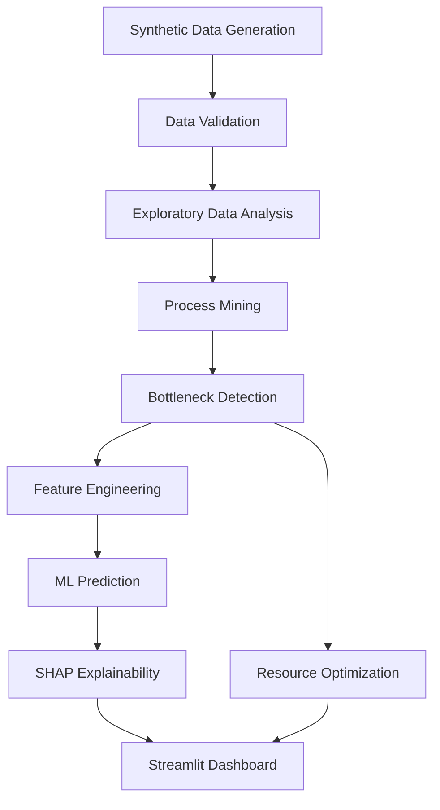
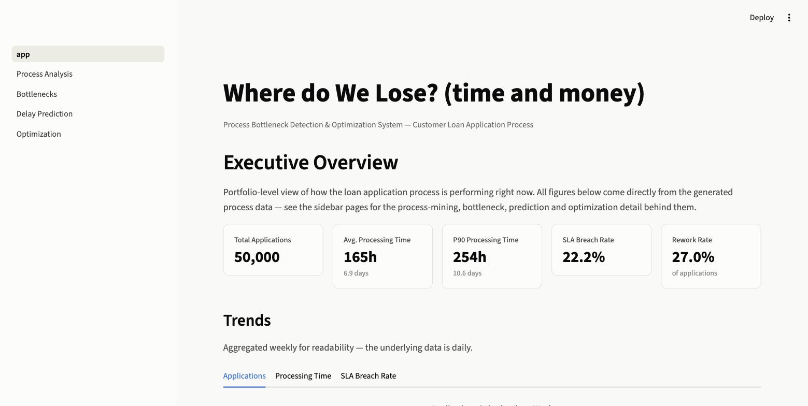
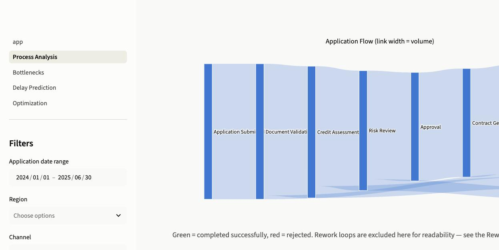
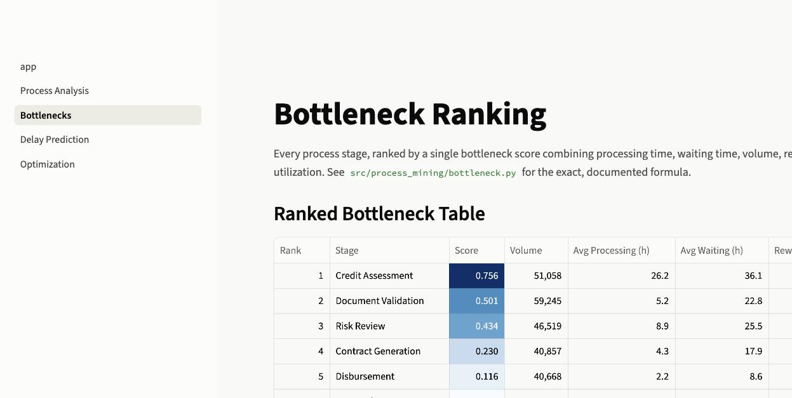
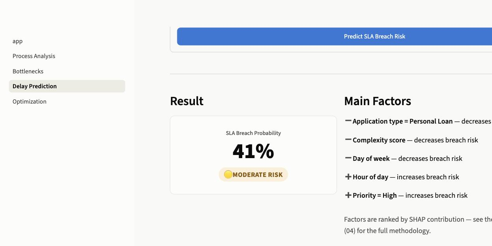
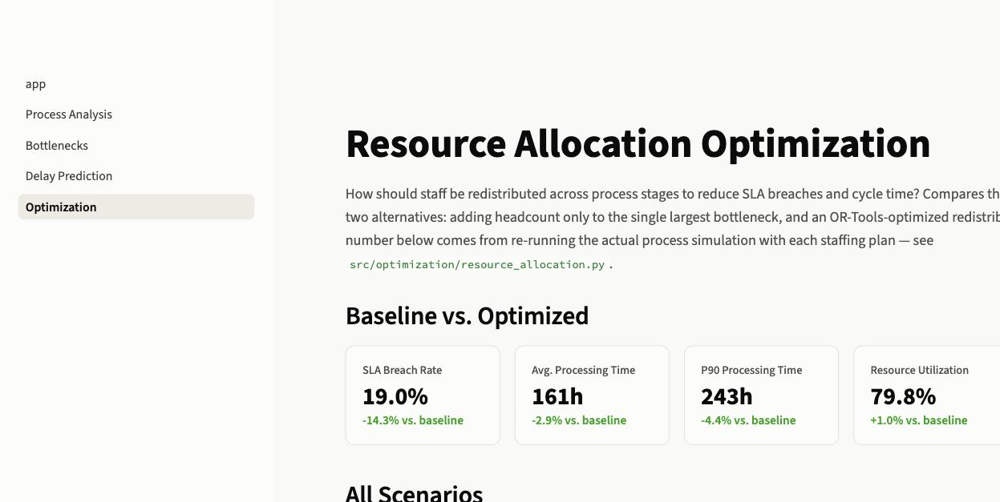

# Where do We Lose? (time and money)

### Process Bottleneck Detection & Optimization System

> An end-to-end Data Science system for detecting operational bottlenecks,
> predicting SLA breaches, and optimizing resource allocation in a simulated
> financial services (loan application) process.


---

## Business Problem

A bank's **Customer Loan Application Process** moves every application
through eight stages — Submitted, Document Validation, Credit Assessment,
Risk Review, Approval, Contract Generation, Disbursement, Completed — with
rework loops and rejections along the way. Some applications clear in days;
others take weeks. Management can see that SLA breaches happen, but not
*which stage* is actually responsible, *how much* it's costing in cycle
time, *which upcoming applications* are at risk, or *what staffing change*
would actually fix it.

This project builds the analytics stack to answer those questions on a
realistic, business-rule-driven synthetic dataset (50,000 applications, no
real customer data), end to end: from raw event data to a resource
allocation recommendation a manager could act on.

## Key Questions

1. Which stages are creating the largest bottlenecks?
2. Which departments generate the most waiting time?
3. Where is rework occurring, and why?
4. Which process characteristics are associated with delays?
5. Can we predict whether a new application will be delayed — *before it
   even starts processing*?
6. What factors contribute most to a predicted delay?
7. How could staff be reallocated to improve throughput?
8. What should management actually do about it?

## Architecture



## Methodology

- **Process mining** (`src/process_mining/`): variants, activity frequency,
  transitions, and a documented estimate of waiting vs. processing time —
  the event log records one timestamp per activity, so the split is derived
  from a per-activity low-percentile floor, not measured directly. See
  `notebooks/02_process_mining.ipynb`.
- **Bottleneck detection** (`src/process_mining/bottleneck.py`): a
  documented, weighted-sum bottleneck score (processing time, waiting time,
  volume, rework rate, resource utilization) — chosen over the spec's
  illustrative multiplicative formula because a product lets any one
  near-zero factor mask a genuine bottleneck; the weighted sum doesn't.
- **Machine learning** (`src/features/engineering.py`, `src/models/`): a
  binary classifier predicting SLA breach **at the moment an application is
  submitted**, before any stage has touched it — three models compared
  (Logistic Regression, Random Forest, HistGradientBoosting) on a
  **chronological** train/val/test split, with an explicit leakage check
  that fails loudly if a post-outcome column ever reaches the feature set.
- **SHAP** (`src/models/explain.py`): global feature importance, a summary
  plot, and a per-application explanation in plain language (feature +
  direction, never a raw SHAP value) — shared by the notebook and the
  dashboard so the two can never diverge.
- **Optimization** (`src/optimization/resource_allocation.py`): an OR-Tools
  CP-SAT model redistributes headcount across stages using an analytical
  queueing-cost proxy to search efficiently, but every *reported* scenario
  metric comes from re-running the actual discrete-event simulation with
  the candidate staffing plugged in — never the proxy.

## Results

*(Generated from `data/raw/*.csv` with seed 42, 50,000 applications,
2024-01-01 to 2025-06-30. Regenerate with `make generate-data` to reproduce
exactly — see [Limitations](#limitations) below.)*

### Process Overview

| Metric | Value |
|---|---|
| Total applications | 50,000 |
| Completion rate / Rejection rate | 80.1% / 19.9% |
| Avg. / Median / P90 / P95 processing time | 165h / 162h / 254h / 282h |
| SLA breach rate | 22.2% |
| Rework rate (≥1 rework) | 27.0% |

### Top Bottlenecks

| Rank | Stage | Score | Avg. Processing | Avg. Waiting | Rework Rate |
|---|---|---|---|---|---|
| 1 | **Credit Assessment** | 0.756 | 26.2h | 36.1h | 4.8% |
| 2 | **Document Validation** | 0.501 | 5.2h | 22.8h | 15.6% |
| 3 | **Risk Review** | 0.434 | 8.9h | 25.5h | 4.9% |
| 4 | Contract Generation | 0.230 | 4.3h | 17.9h | 2.0% |
| 5 | Disbursement | 0.116 | 2.2h | 8.6h | 1.5% |
| 6 | Approval | 0.054 | 1.9h | 7.5h | 2.1% |

**Business interpretation.** Credit Assessment combines the longest
processing time in the process *and* substantial queueing — it's a capacity
problem, not a task-difficulty one (see `notebooks/02_process_mining.ipynb`
for the waiting-vs-processing breakdown). Document Validation's rank comes
from a very different driver: a 15.6% rework rate, itself traced to missing
documents on digital intake channels — a process-quality fix, not a
staffing one.

### SLA-Breach Prediction

Three models compared on a chronological 70/15/15 split, prioritizing
ROC-AUC/PR-AUC over accuracy since breach is a minority class (~22%):

| Model | ROC-AUC (val) | PR-AUC | Precision | Recall |
|---|---|---|---|---|
| **Gradient Boosting** (best) | **0.767** | 0.505 | 0.41 | 0.68 |
| Random Forest | 0.759 | 0.495 | 0.41 | 0.68 |
| Logistic Regression (baseline) | 0.730 | 0.422 | 0.37 | 0.70 |

The selected model reaches **0.771 ROC-AUC on the held-out test set**
(chronologically the most recent 15% of applications, never seen during
training or model selection) — no meaningful drop from validation, so it
generalizes rather than having overfit. SHAP confirms the model learned the
same drivers found through process mining (`application_type`,
`complexity_score`, `risk_score`), not spurious correlation.

### Resource Optimization

| Scenario | Employees | Avg. Processing | P90 | SLA Breach |
|---|---|---|---|---|
| Baseline | 769 | 165.3h | 254.2h | 22.2% |
| A: +20% to Credit Assessment only | 800 (+4.0%) | 162.5h | 245.7h | 20.4% |
| **B: OR-Tools optimized redistribution** | **794 (+3.3%)** | **160.6h** | **242.9h** | **19.0%** |

The optimized plan beats the naive "add staff to the bottleneck" scenario
on **every metric while using fewer additional employees** — it moves staff
away from over-staffed, low-utilization stages (Approval, Contract
Generation, Disbursement: −25%) toward all three genuinely constrained
stages (Document Validation, Credit Assessment, Risk Review: +22–30%), not
just the single largest one. Full comparison: `reports/scenario_comparison.csv`.

## Screenshots

| Executive Overview | Process Analysis |
|---|---|
|  |  |

| Bottleneck Ranking | Delay Prediction |
|---|---|
|  |  |

| Resource Optimization |
|---|
|  |

## Installation

```bash
git clone <repository-url>
cd process-bottleneck-optimization

python -m venv .venv
source .venv/bin/activate          # Windows: .venv\Scripts\activate

pip install -r requirements.txt

# Generate the synthetic dataset (~13s for 50,000 applications)
python -m src.data.generate_data --n-processes 50000 --seed 42

# Run the full test suite (90 tests, ~15s)
pytest

# Train the SLA-breach model and precompute the optimization scenarios
# (needed once, before the dashboard's Delay Prediction / Optimization pages work)
python -m src.models.train
python -m src.optimization.resource_allocation

# Launch the dashboard
streamlit run app/app.py
```

Or, equivalently: `make install`, `make generate-data`, `make test`,
`make train`, `make optimize`, `make dashboard`.

To reproduce the notebooks, register the venv as a Jupyter kernel and run
them in order (01 → 04):

```bash
python -m ipykernel install --user --name process-bottleneck-venv
jupyter nbconvert --to notebook --execute --inplace \
    --ExecutePreprocessor.kernel_name=process-bottleneck-venv \
    notebooks/0*.ipynb
```

## Project Structure

```text
process-bottleneck-optimization/
├── data/
│   ├── raw/                    # generated process_instances.csv, event_log.csv
│   └── README.md               # full data-generation methodology & business rules
├── notebooks/                  # 01 EDA, 02 process mining, 03 bottlenecks, 04 prediction + SHAP
├── src/
│   ├── data/                   # generate_data.py, validation.py
│   ├── process_mining/         # event_log.py, process_metrics.py, bottleneck.py
│   ├── features/               # engineering.py (feature set, leakage check, time split)
│   ├── models/                 # train.py, evaluate.py, predict.py, explain.py
│   └── optimization/           # resource_allocation.py (OR-Tools + scenario simulation)
├── app/                        # Streamlit dashboard (5 pages, shared components)
├── tests/                      # 90 tests across data/metrics/features/model/explain/optimization/app
├── models/                     # delay_prediction_model.joblib (generated)
└── reports/                    # figures/, screenshots/, scenario_comparison.csv (generated)
```

## Technologies

Python · pandas · numpy · scipy · scikit-learn · statsmodels · matplotlib ·
plotly · seaborn · Streamlit · SHAP · networkx · PM4Py · joblib · pytest ·
pydantic · OR-Tools · Jupyter

## Limitations

- **The data is entirely synthetic**, generated from documented business
  rules (see `data/README.md`), not real operational data. Every business
  rule and calibration decision is explained there, including the two
  substantive modeling issues found and fixed during development (a
  calendar-time amplification effect that initially blew up SLA breach
  rates to ~90%, and a resource-utilization formula that initially exceeded
  100% due to a unit mismatch).
- **Results are illustrative of the methodology, not of any real bank.**
  The exact percentages (22.2% SLA breach, etc.) are a property of this
  specific synthetic dataset and calibration, not a claim about real
  lending operations.
- **Regenerating the dataset reproduces these exact numbers** (fixed seed,
  fixed date range) — but changing `--n-processes` or the date range shifts
  average daily volume and therefore utilization, which would require
  re-tuning `STAGE_CONFIG` in `generate_data.py` to stay well-calibrated
  (documented in `data/README.md`).
- **The waiting-vs-processing time split is an estimate**, not a
  measurement — the event log has one timestamp per activity, not separate
  start/complete lifecycle events, which is a common limitation with real
  source systems too.
- **Resource utilization** is measured relative to each department's own
  demonstrated peak throughput, not an absolute hours-worked ratio — a
  deliberate choice after an hours-based version produced impossible values
  (see `bottleneck.py`'s `calculate_resource_utilization` docstring).
- **The optimization's employee cost is a uniform per-head figure**, not
  role- or department-specific compensation, and its analytical queueing
  proxy is used only to guide the search — real scenario metrics always
  come from the actual simulation, but the optimizer's ranking of
  candidates during search still relies on the proxy being a reasonable
  approximation.
- **A real deployment would need**: real event-log validation against this
  schema, monitoring for concept drift in the SLA-breach model, a review of
  whether `risk_score`/`complexity_score` are actually available at
  submission time in the real source system, and legal/compliance review of
  any automated risk scoring used operationally.

## Future Improvements

- Real-time event streaming (Kafka/webhook ingestion) instead of a static CSV
- Online model monitoring and concept drift detection
- Validation against real (anonymized) process-mining event logs
- Cost-sensitive optimization with real per-role compensation data
- Reinforcement learning for dynamic, continuously-updated staffing policy
- Automated anomaly detection for individual applications going off-track
